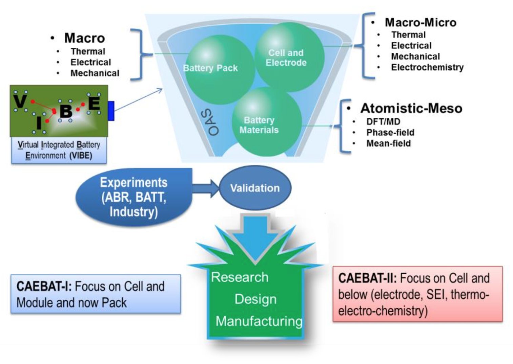
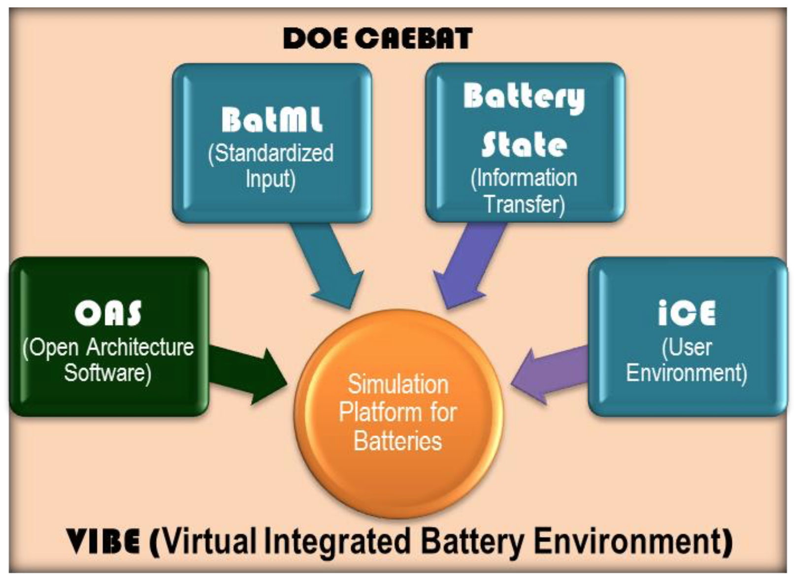

# Introduction

As part of the CAEBAT (Computer Aided Engineering for Batteries) activities,
ORNL developed a flexible, robust, and computationally scalable
open-architecture framework that integrates multi-physics and multi- scale
battery models. The physics phenomena of interest include charge and thermal
transport, electrochemical reactions, and mechanical stresses. They operate and
interact across the porous 3D structure of the electrodes (cathodes and
anodes), the solid or liquid electrolyte system and the other battery
components. The underlying lower-length processes are accounted for through
closure equations and sub- models that are based on resolved quantities. The
schematic of this framework is given in [@Fig:oas-schematic].

{#fig:oas-schematic width=4.0in}

This framework enables seamless integration of the following physical phenomena
that are necessary for development of realistic and predictive battery
performance and safety models:

Mass Transport

- Lithium/electron transport through cathode, anode and electrolyte materials
- Spatiotemporal variations in material properties

Thermal Transport

- Thermal transport through various battery materials as a function of space and time

Electrochemistry

- Primary and secondary reactions
- Interfacial reactions

Mechanical behavior

- Linear and nonlinear mechanics
- Stress/strain relationships
- Fracture at primary and secondary particle levels

The objective of the project is to develop a mathematical and computational
infrastructure, and modeling framework that will enable seamless multi-scale
and multi-physics simulations of battery performance and safety. The modeling
framework will transfer the information between models in a physically
consistent and mathematically rigorous fashion for both spatial and temporal
variations. The end result will be a verified, computationally scalable,
portable, and flexible (extensible and easily-modified) framework that can
integrate models from the other CAEBAT tasks and industrial partners. The
framework will be used to validate models and modeling approaches against
experiments and to support rapid prototyping of advanced battery concepts.
[@Fig:vibe-parts] shows different parts of CAEBAT VIBE simulation environment
that work together to provide user with flexibility in the problem setup,
solution formulation and simulation launch. Each of the parts is discussed in
subsequent sections with corresponding examples.

{#fig:vibe-parts width=4.0in}

