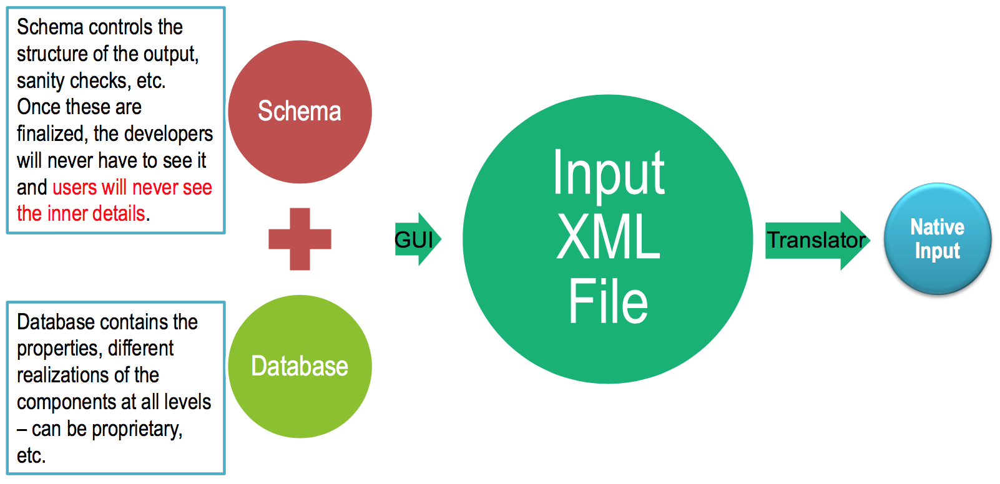
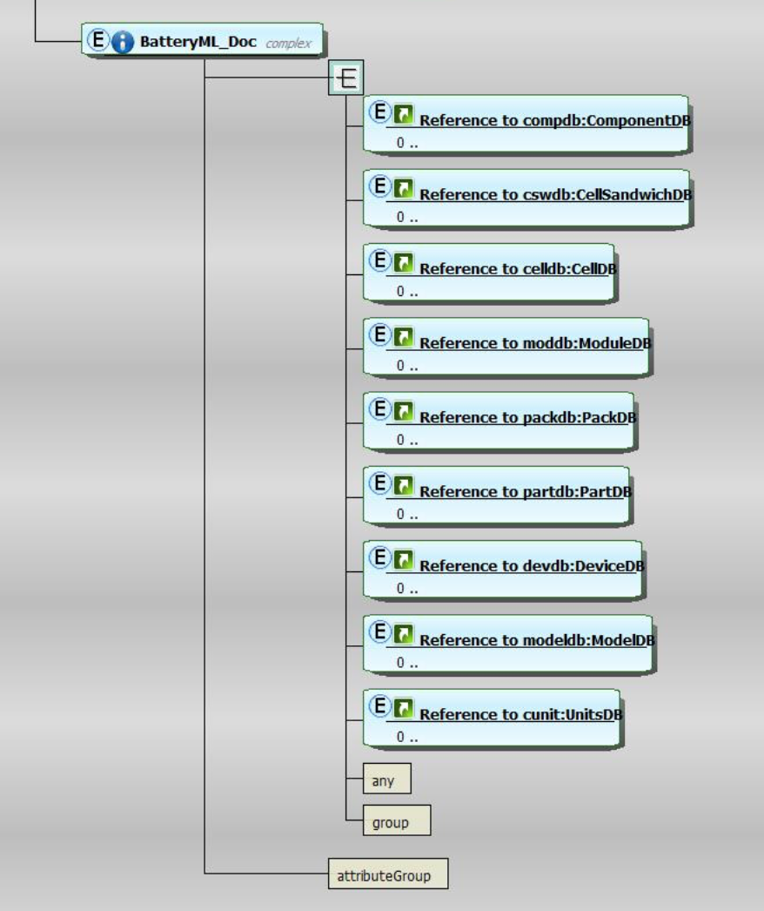
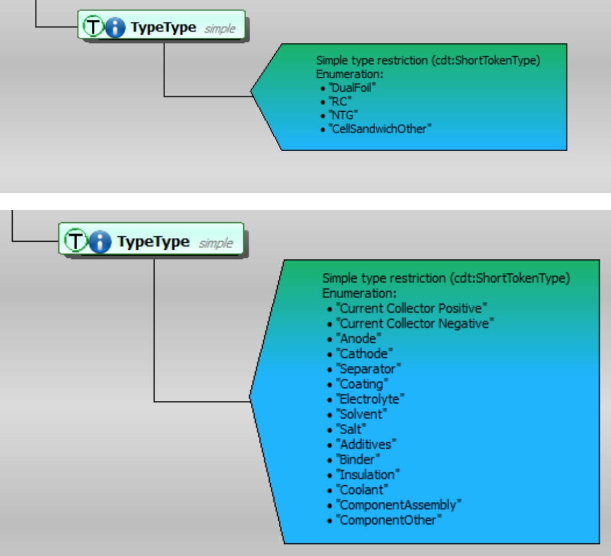

# Battery Markup Language (BatML)

The objective of the BatML specification is to provide standardized format for
definition of all the necessary information for battery performance and safety
modeling. The overall design for the BatML is given in [@Fig:batml-structure]
below. The BatML Schema establishes the main structure for the BatML data files
and enables data validation and consistency checking. BatML files can contain
databases and models with default values or with company proprietary
information. For e.g., Dow-Kokam or Johnson Controls can provide a database of
their cell- sandwich properties that an OEM can directly use in their models.
Several examples based on open literature for standard battery materials and
components have been developed and made available to the project partners. The
graphic workflow environment described later in this documentation (ICE) uses
these Schemas and Databases along with any additional user input to create a
BatML input file.  This XML file can either be used directly by simulation
packages or through translators that transform this input into native formats
read by the different software components.

{#fig:batml-structure width=4.0in}

The top-level structure of the Battery ML Schema (available at the CAEBAT
project website http://batterysim.org) is shown in [@Fig:batml-schema]. Here we define a
battery component type that contains the base components such as anode,
cathode, electrolyte, separator, current collectors. These base components are
used to build higher-level components such as cell-sandwich, cell, module,
pack, parts (e.g., busbar, cooling fins). Each of these components can contain
additional sub-components, as their definition is dependent on the form of
model used. For e.g., the cell-sandwich definition will depend on the model for
electrochemical component. The Cell can be further specified as Cylindrical
cell, Prismatic cell, etc. To enable this flexibility, we picked the relational
data model (hierarchical data model will also be implemented in the language).
The main considerations for selecting the relational versus hierarchical data
model were:

- Batteries have very deep hierarchy and the hierarchical data model will lead to considerable duplication of the data
- Relational data model provides the flexibility to quickly modify the hierarchies of the models and add new components
- Relational approach requires that all the references to the data exist and that the model is self- contained. This does not impose a strong limitation because the input files will be primarily manipulated using GUI and not by user editing of the XML files.
- Cross referencing in relational data model drastically reduce data duplication and the corresponding risk for errors

{#fig:batml-schema width=3.0in}

Once the DualFoil model has been selected, it can be further subdivided into
different components of the cell sandwich. The Battery ML schema imports the
cell-sandwich schema (whose structure is shown in [@Fig:batml-components] and
can be downloaded from the project’s web site) that further specifies the
details of its components. Similar hierarchical expansion can be used to define
cell, module, pack, etc. Current implementation contains the above battery
hierarchy.  Translators between BatML and other input formats of CAEBAT
partners have been developed with the final goal of BatML becoming a standard.
[@Fig:batml-ecpower] compares the EC Power input and conversion to BatML.
Similar translators have been developed for Text Battery Model (.tbm) files
(BDS/CD Adapco), .svm files (NREL MatLab model), as well as ANSYS input. We
keep the project’s website up to date with the latest version of the schema,
corresponding documentation and examples, schema validation tools, etc.

{#fig:batml-components width=3.0in}

{#fig:batml-ecpower width=4.0in}

