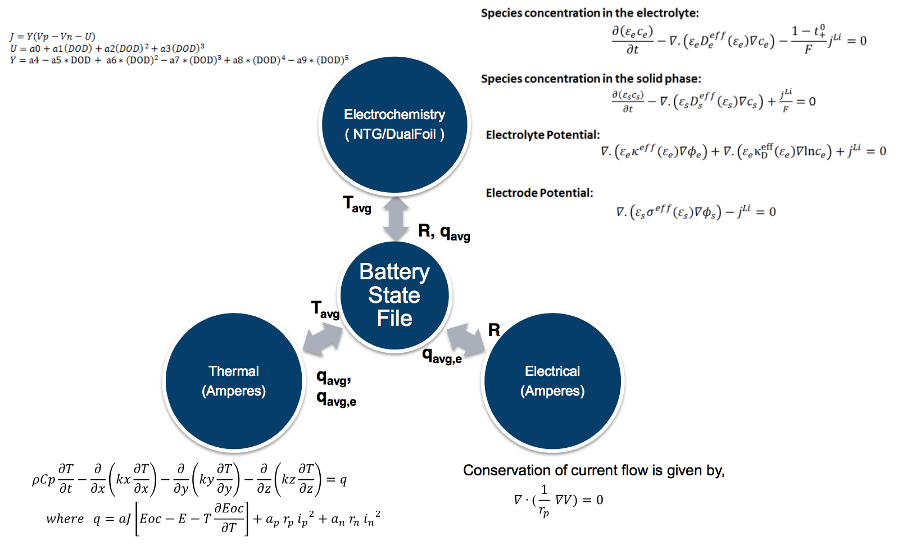

# Battery State

The OAS framework integrates battery models using component and state adapters.
The component adapters interact with the components by preparing the necessary
inputs to run the components and by scheduling the component runs. The state
adapters interact with the battery state file(s) by updating all the necessary
information about the battery state and the methods for coupling the
components. [@Fig:battery-state] shows a battery state file that transfers the information
between the electrochemistry, thermal and electrical physics components. The
device hierarchy is modeled by coarse-graining of the underlying
sub-components. The top hierarchical level of the model is divided into zones.
These zones then transfer information between the components in case of loosely
coupled multi-physics simulations. Further description and examples of the
battery state are given in the sections that follow.

{#fig:battery-state width=5.0in}

