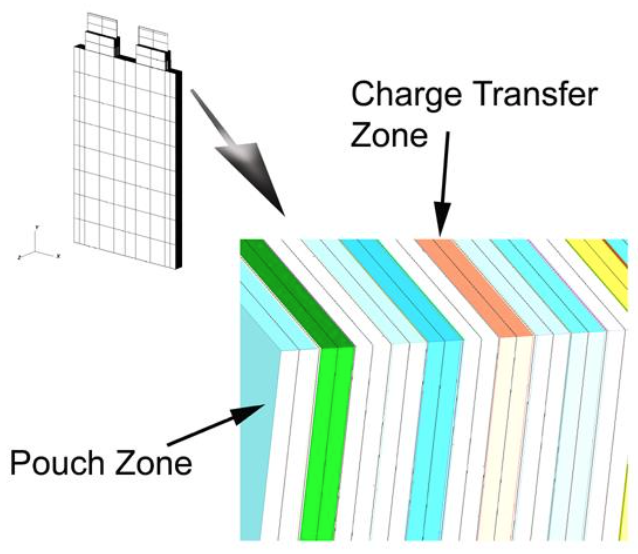
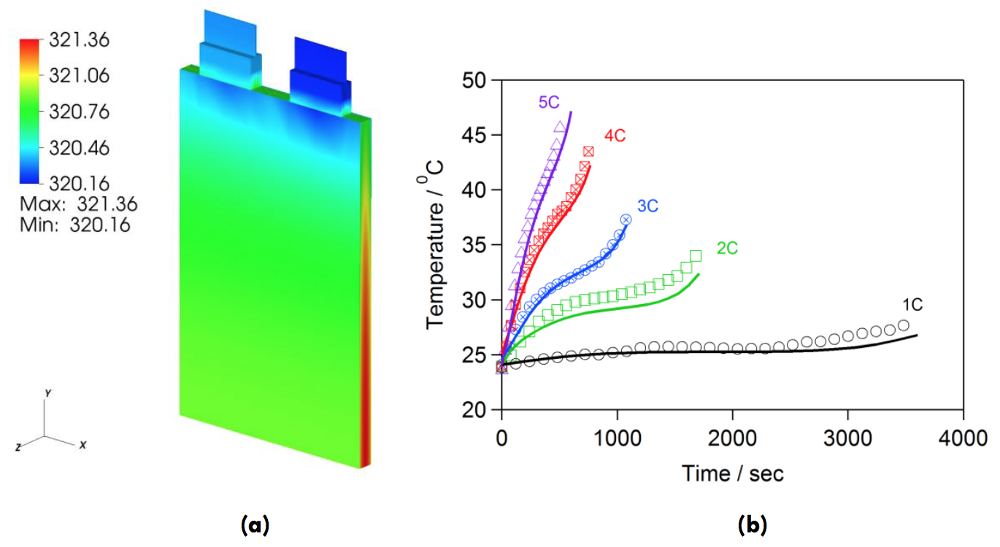

# Example Applications

The examples provided in the following sections are currently availabe as part
of the VIBE package.

## Example 1: Cylindrical Cell (Electrochemical-Electrical-Thermal)

This example (located in the VIBE repository at examples/case3/) represents the
geometry of a rolled cylindrical cell. The main model properties are given in
the table below. [@Fig:cylinder-mesh] shows the geometry and the finite element
mesh used to resolve the geometry of the cylindrical cell and the current
collectors. The top hierarchy model has 168 (56 each for the cell-sandwich and
positive and negative current collectors) zones in 4 quadrants. The zones
describe different current collector and cell sandwich regions. The simulation
uses 56 concurrent Dualfoil simulations for different cell-sandwich zones.
Typical results are shown in [@Fig:cylinder-results]. The maximum temperature
occurs at the cell core as expected.

`* table here *`

{#fig:cylinder-mesh width=4.0in}

{#fig:cylinder-results width=4.0in}

## Example 2: Pouch cell (Electrochemical-Electrical-Thermal)

This example (located in the VIBE repository at examples/case6/) represents the
geometry of a prismatic pouch cell. The electrochemistry is modeled using the
NTG model instead of the DualFoil model. The cell under consideration is a 70mm
x 110mm x 10mm 4.3 Ah pouch cell manufactured by Farasis Energy, Inc with the
properties given in the table below. The pouch cell in the current study
contained 17 cathode and 17 anode layers and the finite element mesh was
divided into 71 corresponding zones for cell sandwich, current collectors, and
pouch ([@Fig:pouch-mesh]).

`* table here *`

{#fig:pouch-mesh width=4.0in}

The example of the simulation results is shown in [@Fig:pouch-results] and
represents a temperature distribution in a pouch cell following a discharge at
5C rate of applied current. At such high applied current significant increase
in temperature can be observed in the cell core. The simulation results have
been validated with the experiments involving IR temperature measurement on the
surface of the pouch cell ([@Fig:pouch-results]b). Experiments agree well with
the predicted temperature profiles for all C-rates.

{#fig:pouch-results width=4.0in}

## Example 3: 4P and 4S battery module

In this example, the single pouch cell described in the previous section is
used as a building block for a module, containing 4 cells in parallel or in
series. The example is in the repository in examples/case7/. Meshes
representing parallel (4P) and series (4S) module configurations are shown in
[@Fig:cell-arrangement]. No cooling fins were placed between the cells in this
model. The mesh consists of approximately 150,000 FE nodes and 308 zones in the
whole module thus resolving each current collector. Concurrent electrochemical
model runs (DualFoil was chosen in this case) were performed in 136 charge
transfer zones within the module. The goal of this study was to estimate
temperature variations across the cells connected in series and in parallel.

{#fig:cell-arrangement width=4.0in}

The results of the simulations when symmetric cooling to the module surfaces is
applied with a convective heat transfer coefficient of 35 W m-2 K-1 are shown
in [@Fig:cell-discharge]. As can be seen both parallel and series cases result
in very similar distribution of temperature across the module. In both cases, a
5C discharge rate was applied.

{#fig:cell-discharge width=4.0in}

## Example 4: 4P module under dynamic discharge

In this example, the mesh corresponding to the 4P module is used to simulate
the dynamic discharge under the user supplied variable
potentiostatic/galvanostatic conditions. The example can be found in
examples/case10/. The model uses DualFoil and AMPERES Thermal components. An
option of driving simulation under varying current (dynamic discharge) has been
added in the current release. The key-value pair file (for detailed description
of sections of the input and configuration files please see Appendix A)
contains several lines dedicated specifically for this new option. The
following keywords are used to describe the cycling profile:

NUMSEG - Number of segments in the cycling profile.

CURRDEN - List of current density values corresponding to each segment.

MODESEG - List of segment modes. Most commonly used are 0 for potentiostatic and 1 for galvanostatic.

CUTOFFL - Lower cut-off potential.

CUTOFFH - Upper cut-off potential.

NOTE: If the NUMSEG keyword is missing in the key-value pair input file, the
simulation will assume a default constant current discharge.

To utilize the dynamic discharge capability, the time stepping must be
specified using the EXPLICIT option in the simulation config file with
explicitly specified values of time corresponding to the segments of the
cycling profile. Please see Appendix A for detailed description of input and
config files required to launch a simulation.

If zero current density is specified in CURRDEN, the simulation will be
performed under potentiostatic condition using the OCP corresponding to the end
of previous cycling segment.

