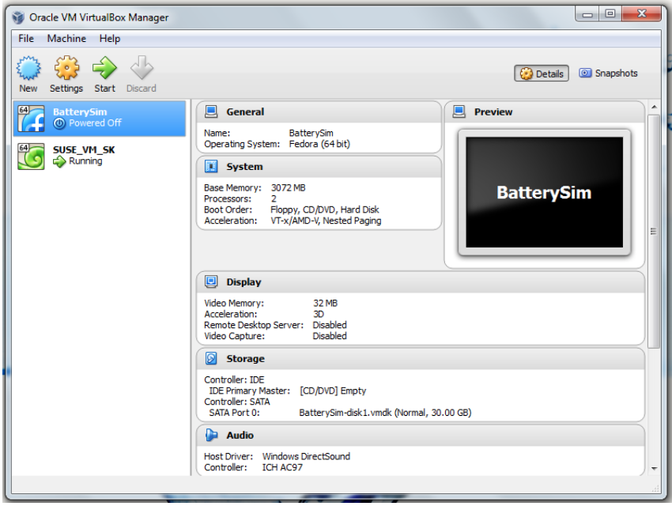
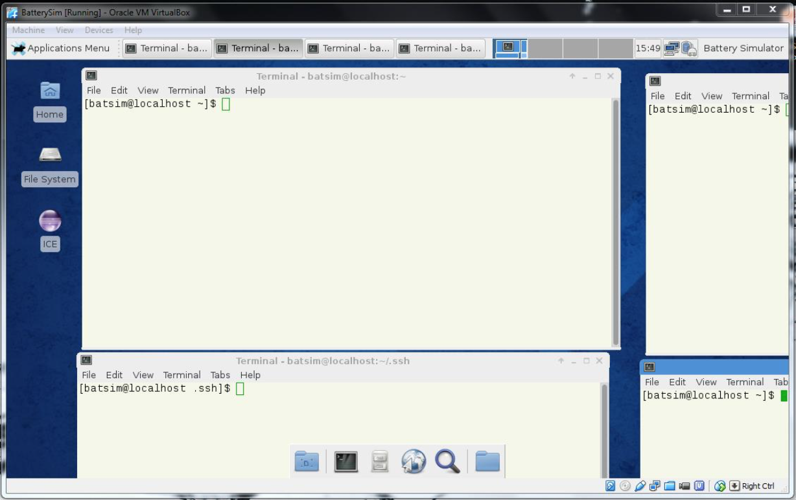
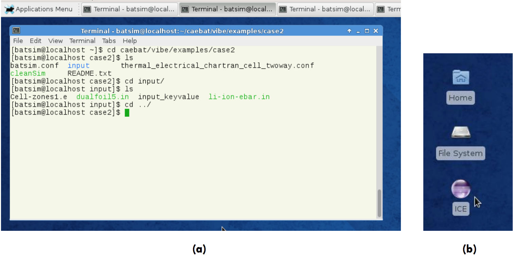

# Getting Started

The following sections provide instructions on running VIBE in a virtual
machine or as a Docker container.

## Running VIBE in a virtual machine

In order to enable a user to take VIBE for a ‘test drive’ we have the software
packaged within a Virtual Machine (VM) which can be installed on user’s machine
of choice. This section describes the instructions on how to run the simulation
in VM. The virtual machine is packaged into the open virtualization format
archive `BatterySim-release<Version>.ova` which can be downloaded from the
project website. Before using the VM the Virtual Box software needs to be
installed on the user machine. The software can be downloaded from
[virtualbox.org](https://www.virtualbox.org/) together with the installation
instructions and user manual. Once installed, start the Virtual Box and click
on File > Import Appliance. This will open the dialogue box where you can
select the BatterySim-release.ova as your virtual machine. After such
selection, BatterySim will appear in the list of the virtual machines within
the left panel of Virtual Box ([@Fig:virtualbox]).

{#fig:virtualbox width=4.0in}

If you have several virtual machines select the BatterySim and start the VM.
There is no password for the BatterySim, so simply press Return key. This will
open the Fedora Linux environment as shown in [@Fig:batterysim-vm].

{#fig:batterysim-vm width=4.0in}

From here the user can navigate to the examples directory and run the
simulations in command line as described in APPENDIX A. In
[@Fig:vm-commandline]a the terminal window navigating to case 2 is shown with
corresponding simulation configuration file (thermal_*.conf) and the input
directory which stores input files as well as mesh (exodus *.e file). After the
simulation is complete, the case directory will be populated with log files
containing information on simulation run and possible errors as well as a new
work directory which contains the results of simulation and the battery state
CGNS file. More on the directory structure and command line launch instructions
is given in Appendix A. Alternatively user may launch ICE by double-clicking on
the ICE desktop icon ([@Fig:vm-commandline]b). Instructions on running
simulations with ICE can be found in Appendix B.

{#fig:vm-commandline width=5.0in}

The home directory of the battery simulator is /home/batsim/ and it contains
installation of OAS (/home/batsim/oas/) and VIBE with the simulation cases
(/home/batsim/vibe/). Paths for components’ drivers and executables are
included in configuration file batsim.conf which is placed in a separate
directory /PathTo/examples/config/ and is used by each simulation case.
Simulation can thus be launched from the case directory by specifying the OAS
directory and simulation configuration and pressing the Return key:

```bash
$ /home/batsim/caebat/oas/install/bin/ips.py \
--simulation=thermal_electrical_chartran_cell_twoway.conf \
--log=temp.log --platform=../config/batsim.conf -a
```

The BatSim virtual machine comes with four simulation cases packaged in
examples directory. These involve different battery and module geometries and
physical models as discussed in APPLICATION EXAMPLES section. For instance
running the simulation of case2 as described above will provide a loosely
coupled electrochemical-thermal-electrical solution for unrolled cell with
DUALFOIL as electrochemical component. Details of the simulation cases are
given in Appendix A and Appendix B.

## Running VIBE in Docker

Using Docker container to run the software is an alternative way to using the
virtual machine. The details and installation instructions depending on the OS
can be found at [docker.com](https://www.docker.com/). The following
instructions explain how to:

- launch the VIBE container
- connect to the container from ICE
- stop and remove the container

**Launch the VIBE container**

Pull the latest version of the VIBE container:

```bash
$ docker pull rombur/vibe-ssh
```

Download the private key id_rsa_vibe:

```bash
$ wget https://raw.githubusercontent.com/Rombur/VIBE/master/remote/id_rsa_vibe
```

Run the container:

```bash
$ docker run -d -p 2222:22 --name vibe_ssh rombur/vibe-ssh
```

This will run in detached mode a container named vibe_ssh using the image
rombur/vibe-ssh. It will also map the port 2222 of your machine to the port 22
of the container. This port has been exposed in the container.

**Connect to the container from ICE**

Use ICE like you would do in the VM with two differences.

Because the examples are in the container not in your local machine, you cannot
browse them. If you want to use the input files from the examples, you will
need to copy them from the container. You can connect to the container using
the following command:

```bash
$ ssh -i id_rsa_vibe -p 2222 root@localhost
```

With this command, ssh will use the port 2222 of your machine and the private
key id_rsa_vibe to connect to the container. The examples can be found in
/opt/vibe/examples. If you want to copy case1 from the VIBE container into you
working directory, you can do:

```bash
$ docker cp vibe_ssh:/opt/vibe/examples/case1 .
```

Inside the VibeLauncher window, in the Hosts pane, you need to change the
hostname from localhost to docker and the Execution Path from
/home/batsim/caebat to /opt. To do so, simply click on localhost and
/home/batsim/caebat. Once you launch the job, a window should pop up to specify
the properties of the new connection. In the Host field, write localhost. In
the User field, write root. Click on Network Connections, SSH2, then click on
Add Private Key... and add the id_rsa_vibe file. Back on the New Connection
window, under Advanced type 2222 in the Port field.

The container will still run even after you exit ICE. You will need to stop and
remove it yourself using:

```bash
$ docker stop vibe_ssh
$ docker rm vibe_ssh
```

To check that the container has been stopped, type:

```bash
$ docker ps
```

There should not be any container named vibe_ssh. To check that the container
has been removed, type:

```bash
$ docker ps -a
```

There should not be any container named vibe_ssh.

