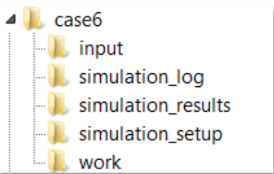
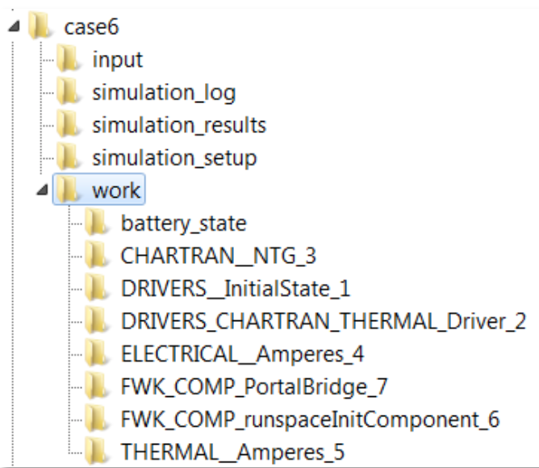
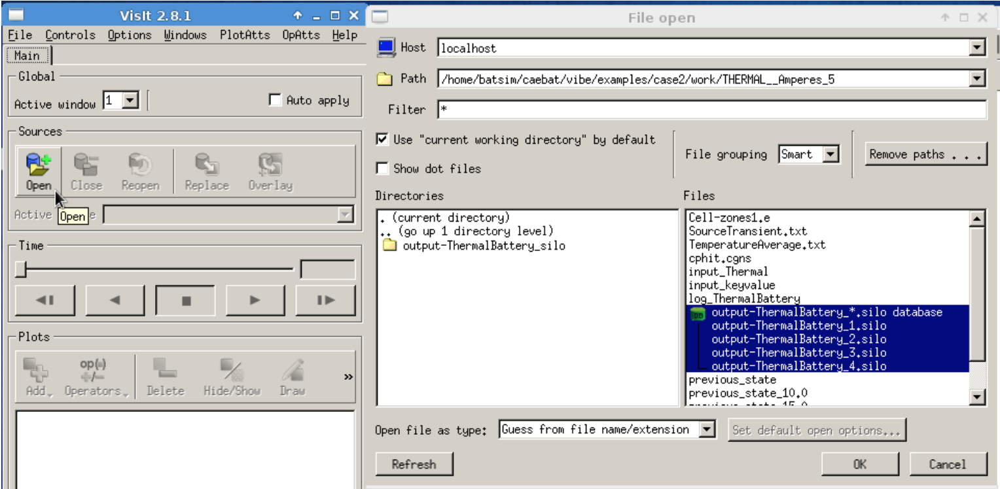

# Appendix A: Command line OAS/VIBE launch instructions

This section describes the simulation launch procedure using command line as
opposed to using integrated computation environment (ICE) which is detailed in
the next section. All simulation scenarios (cases) are a part of VIBE and
correspondingly are placed in PathTo/vibe/examples/ directory. When running in
BatterySim virtual machine this directory will be located in
/home/batsim/caebat/vibe/examples/. As an example the coupled
electrochemical-electrical-thermal modeling of a prismatic cell (case 6) is
considered here. The structure of the directory case6 is shown below.

{width=2.0in}

The input directory contains mesh file (Exodus file) of the geometry as well as
key-value pair input file to set up material constants in simulation models.
This file needs to be edited if different boundary conditions and/or model
parameters are desired. In the present configuration of VIBE the input_keyvalue
file has the following fields:

{width=4.0in}

The names of the keys in the input file are to a great extent self-explanatory.
ICSHORT parameter determines whether internal short circuit is modeled in
either thermal or electrical components. NUMBCS sets up the number of boundary
conditions with BCIDS representing IDs of the side sets in the corresponding
mesh file where the boundary conditions are to be applied. Two types of
boundary conditions can be set with BCTYPE=1 representing Robin boundary
conditions and BCTYPE=2 representing the Dirichlet type of BC. In the above
example, the block of electrochemical model parameters represents the NTG model
setup. A slightly different setup is required when the Pseudo 2D model
represented by DualFoil subroutine is used. Parameter CUTOFF sets the voltage
at which discharge of the cell terminates. CURRDEN is the applied current
density in A/m2 in the cell (current normalized by the total area of the cell).
THICKNESS determines the thickness of the cell sandwich (in meters). The
YPolyDegrees and UPolyDegrees vectors set the dimensions of the polynomial fits
for Y and U functions in NTG model (please see formulation of models in the
Battery State section of this release document). The first element of the
vector represents the order of the polynomial that describes impedance (Y) or
OCP (U) as a function of depth of discharge. If the discharge curves at of the
cell different temperatures are available, the corresponding fits can be made
bi-polynomial in which case the degree of polynomial in temperature is
described by the second element of the vector. In case when the thermal
behavior data are not available, this member is simply set to zero, as in the
above example. YPolyCoefficients and YPolyCoefficients are the vectors
containing the coefficients of the corresponding polynomial fits. Once the
input file has been modified accordingly and saved the simulation parameters
can be configured. This is done within the simulation configuration file
SimulationName.conf. The simulation config file captures the components used in
the simulation, total number of variables passed through the Battery State,
input/output from the components and corresponding component drivers. If a
different model is desired this can be changed here. While the example case6
uses NTG model to describe electrochemistry, this can be changed to Pseudo 2D
component (DualFoil) if needed and if all material constants required for
DualFoil code to run are available. Within the configuration file [PORTS]
change the [[CHARTRAN]] implementation to IMPLEMENTATION = DUALFOIL. The
corresponding component specification can be added to the configuration file,
for instance:

```bash
[DUALFOIL]
    CLASS = CHARTRAN
    SUB_CLASS =
    NAME = DualFoil
    NPROC = 1
    BIN_PATH = $CAEBAT_ROOT/bin
    INPUT_DIR = $SIM_ROOT/input
    INPUT_FILES = 'dualfoil5.in' , 'li-ion-ebar.in'
    OUTPUT_FILES = 'df_caebat.out'
    INPUT_VAR = 'lumped_temperature'
    OUTPUT_VAR = 'lumped_source' , 'lumped_resistance'
    SCRIPT = $BIN_PATH/dualfoil_chartran.py
```

In this case, the DualFoil Fortran code requires two input files that need to
be placed in the input directory of the simulation case. More on the DualFoil
code description and requirements can be found at
[cchem.berkeley.edu](http://www.cchem.berkeley.edu/jsngrp/fortran.html). The
last set of parameters in the simulation config file defines the time marching.

```bash
[TIME_LOOP]
   MODE = REGULAR
   START = 0.0
   FINISH = 30.
   NSTEP = 2
   VALUES = 3.4 3.5 3.6 3.7
```

Two ways of setting up the time step can be implemented. REGULAR mode defines
beginning, end and number of time steps to take during the simulation. EXPLICIT
mode allows specification of a vector containing specific values of time at
which simulation should be performed. In the latter case the software uses the
variable named VALUES. Time is specified in minutes. EXPLICIT method allows
using non-uniform size of time steps and is useful where cell potential changes
abruptly compared to otherwise smooth profiles where a large time step is
sufficient to progress the simulation. This mode must be used with dynamic
discharge option.

Once the input files have been edited and simulation configuration has been
set, the simulation (case6 in virtual machine BatterySim in this example) can
be launched from the command line by running the following line from the
simulation case directory:

```bash
$ /home/batsim/caebat/oas/install/bin/ips.py --simulation=thermal_electrical_chartran_farasis.conf \
--log=temp.log --platform=../config/batsim.conf -a
```

When simulation completes the results can be found in work directory where they
are arranged by the simulation component.

{width=2.0in}

The CFD General Notation System (CGNS) is used to store the variables in zones.
The corresponding state file named cphit.cgns is stored in battery_state
directory. The results of the simulation can be retrieved from
THERMAL_Amperes_5 and ELECTRICAL_Amperes_4 directories with the integer in the
directory name showing the number of the component in sequence. These
directories contain the *.silo files that can be viewed and processed further
with VisIt. Since the Virtual Machine comes with VisIt installed, the user can
launch it from any directory by simply typing ‘visit’ in the command line and
pressing Return key. This starts the visualization software where the
simulation results can be loaded as a silo database ([@Fig:outputfiles]) or a single file.

{#fig:outputfiles width=4.0in}

To view the temperature distribution in VisIt, add a Pseudocolor plot and
select Battery_Temperature from the list of variables ([@Fig:thermal-visit]a). Clicking on
the Draw button will create a plot in the output window ([@Fig:thermal-visit]b).

{#fig:thermal-visit width=5.0in}

Rotation, zoom, slicing, transforms, lighting, etc. can be performed in VisIt.
More on this software can be found at
[wci.llnl.gov](https://wci.llnl.gov/simulation/computer-codes/visit/).

The plot in [@Fig:thermal-visit] shows the distribution of temperature in unrolled strip
(once cell sandwich) when 2C discharge current is applied and one end of the
cell is held at room temperature. The solution is obtained with Pseudo2D model
(DUALFOIL) used as an electrochemical component. As already mentioned, the
model can be changed to NTG by replacing DUALFOIL with NTG in the PORTS section
of the configuration tile. The BatterySim Virtual Machine comes with five
different cell and module simulation setups, contained in
/home/batsim/caebat/vibe/examples directory as:

- Case2: unrolled cell. Useful for testing new cell parameters (for example different materials or porosities) to get an idea about modeling on a cell-sandwich level.
- Case3: cylindrical Li-ion cell.
- Case6: pouch cell.
- Case7: 4P and 4S modules of four pouch cells from case 6 connected in series (4S) or in parallel (4P)
- Case10: 4P module of four pouch cells with dynamic discharge

Any of the above simulations can be launched either from command line as
described in this section or using ICE as described in the Appendix B.

