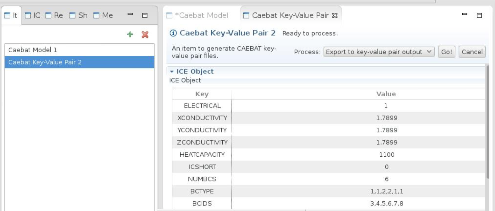
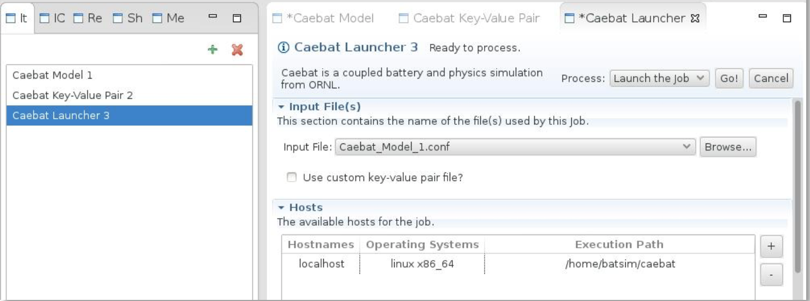
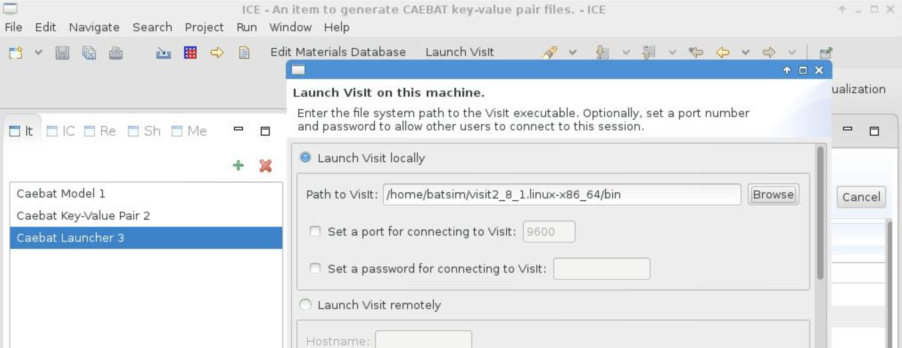
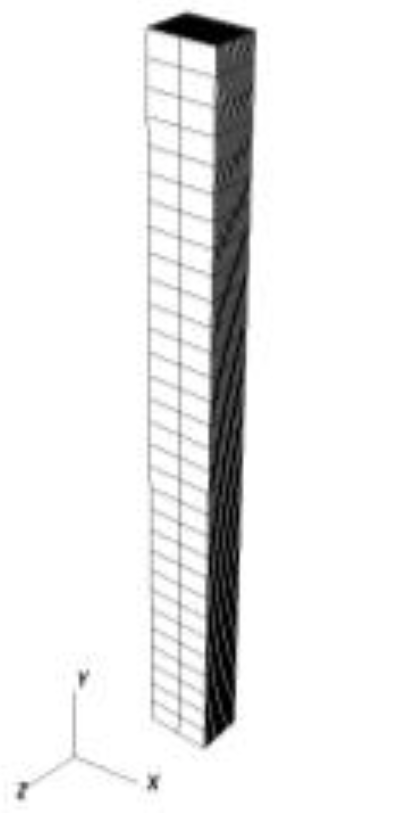
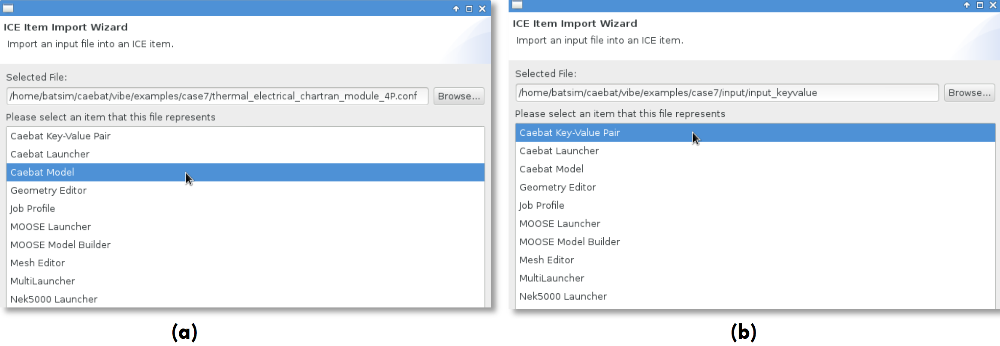
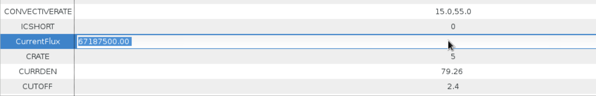
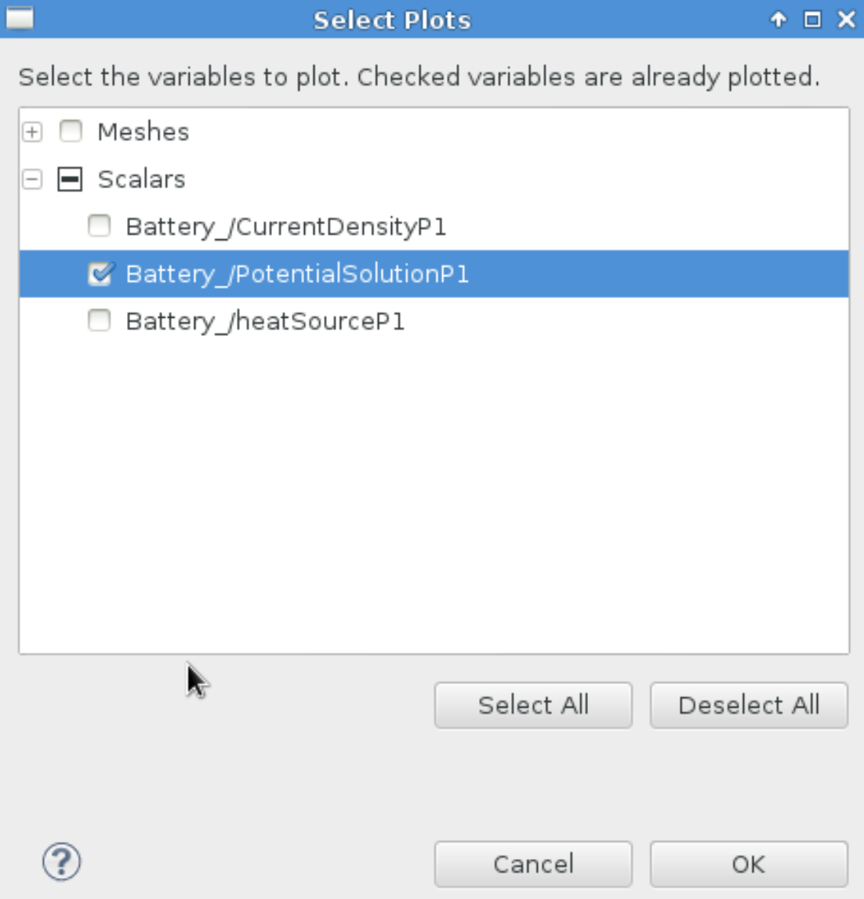
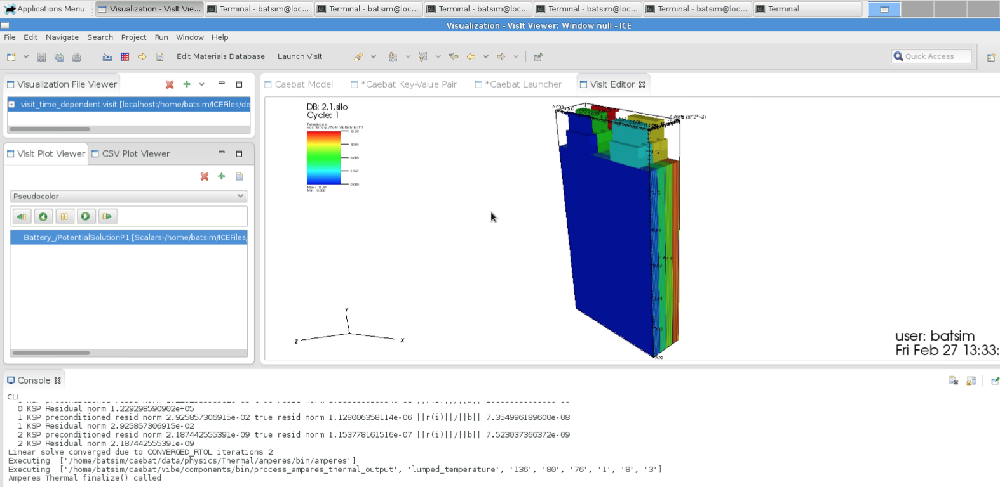

# Appendix B: Launch instructions with ICE

This section provides the tutorial on setting up and running a battery
simulation using ICE. It is encouraged that the user becomes familiar with the
VIBE directory structure by studying Appendix A first and launching a
simulation from command line. Overall the workflow in ICE consists of:

- Creating the model by working with simulation configuration file (Caebat Model)
- Creating the simulation input (Caebat Key-Value Pair Generator)
- Setting up the job launch and running a simulation (Caebat Launcher)
- Viewing the results

We created several predefined simulation cases dealing with different cell
geometries: unrolled cell sandwich, rolled cylindrical cell, pouch cell and
module of four pouch cells. All these cases come with the Virtual Machine VIBE
release. The case of 4.3 Ah pouch cell (case6) is a default simulation setup in
ICE and the tutorial below discusses the default case first.

## Creating the model

To begin, launch ICE (if it isn’t already running), and you should be presented
with an empty workbench. Navigate to the ICE Perspective by choosing Window >
Perspective > Other and scrolling to ICE in the pop-up view. In this
Perspective, ICE provides three options for creating new items. The user may
click on the green plus icon (+) located near the top-right corner of the Item
Viewer, click on the New Item button in the main ICE toolbar, or choose File >
Create an Item. This will launch a dialog prompting you to select a task (or
Item) to create (see [@Fig:ice-selector]). Find Caebat Model Builder in the
Item Selector list and click Finish.

{#fig:ice-selector width=4.0in}

A CAEBAT Model Builder will appear in the main workspace with the default
values corresponding to the pouch cell model. You can now edit the parameters
if for instance a different number of time steps or different total time is
desired. The CAEBAT Model window has two tabs (Fig. 21):

- Time Loop Data, Global Configuration, etc
- Ports Master

Time Loop Data window (Fig 21a, b) allows you to select the battery geometry,
time stepping scheme, components taking part in the simulation and global
configuration. The Ports Master window (Fig. 21c) shows the corresponding input
directories, input/output variables that are passed through the battery state,
and path to each component involved in the simulation. Input directories
containing meshes are also specified here. For now leave all the parameters
with their default values and click Go!.

{#fig:ice-model width=4.0in}

## Generating simulation input key-value pair file

The key-value pair input file contains numerical parameters necessary for
simulation, such as material constants, boundary conditions and coefficients of
polynomials when NTG model is used to represent electrochemical component. To
pull up a default Key-Value file for edit, in Item Viewer click on the green
plus icon again and select Caebat Key-Value Pair from the drop down menu
([@Fig:ice-selector]). The file with default values corresponding to the pouch
cell simulation is displayed for edit ([@Fig:ice-keyvalue]). The keys are
explained in Appendix A. The default simulation represents a discharge of 4.3
Ah cell with gradient of temperature applied as boundary conditions (BCs) to
the cell surfaces. These settings can be edited here if different BC or
different polynomials for NTG model are desired. For now accept the default
values (case6) by clicking Go!.

{#fig:ice-keyvalue width=4.0in}

This completes the CAEBAT input generation task. The file generated will be
used in the next step by the CAEBAT Launcher to run the CAEBAT problem.
However, if you’d like to review your input file before launching, you can do
so by opening the File > Open File... menu in ICE, and navigating to the file.
Once opened, you will be able to review the input file generated.

## Launching a CAEBAT job

Once the appropriate input files have been generated, launching a simulation is
a relatively simple task. To get started, click the green “+” button once more
to create a new ICE Item. Select Caebat Launcher ([@Fig:ice-selector]) from the
menu and click OK. A form will appear in the main ICE workbench area
([@Fig:ice-launcher]). This form contains the information necessary for
launching a CAEBAT problem. The first piece of necessary information is to
specify an input file. From the drop down menu choose the configuration file
generated for the Caebat Model (in our case Caebat_Model_1.conf). If you
created your own input file in the previous step using the CAEBAT Model
Builder, this file should appear in the list of available files.

The next step is to specify on which machine CAEBAT will be run, either locally
or remotely. A default is localhost, however, additional hosts can be added by
clicking the “+” button to the right of the Hosts table. When adding hosts, set
the Execution Path to the directory of the machine’s CAEBAT installation. If
you are launching on a remote machine, also be sure that you have appropriate
privileges for the CAEBAT install directory.

Lastly, use the Process menu in the upper right-hand corner; select the Launch
the Job task from the drop- down menu and click the Go! button. Depending on
your host machine’s configuration, you may be prompted for login credentials.

{#fig:ice-launcher width=4.0in}

As the simulation progresses the console window will display different
information related to each component being executed in sequence. The
simulation is finished when the Done! is displayed in Caebat Launcher:

{#fig:caebat-launcher width=4.0in}

## Visualizing output

The output produced by a CAEBAT job can be visually analyzed in ICE by
utilizing the VisIt plug-in. Click on Launch Visit and select the location for
VisIt installation. If the simulation was run in Virtual Machine, select Launch
Visit Locally and then click browse and select the path to VisIt binary
([@Fig:launch-visit]). Scroll down and give this connection a name (any
characters) and then click Finish.

{#fig:launch-visit width=4.0in}

Click on Open Perspective and select Visualization from the list ([@Fig:visualization]a).
Switch from ICE to Visualization mode. In Visualization File Viewer selection
can be made for the files to view. Select the desired silo file(s) from the
/home/batsim/ICEFiles/default/jobs/iceLaunch_Date_Time/work directory. The work
directory of the simulation contains the results as described in APPENDIX A.
Select the silo file(s) corresponding to the thermal solution from the
THERMAL_Amperes directory.

{#fig:visualization width=4.0in}

In the Visit Plot Viewer add a new plot by clicking the green “+” and selecting
Scalars > Battery/Temperature to view the temperature distribution in the cell.
Double click on the file name in the Visit Plot Viewer. Select pseudocolor from
the drop down menu of plot options. The result shows a temperature distribution
in the pouch cell under non-uniform cooling of the edges ([@Fig:pouch]). The
visualization capabilities in ICE allow object rotation, translation, and zoom
in/out. If several silo files were loaded with each file representing a time
step, a play feature can be used to step through the solutions and see the
progression in time. These capabilities provide a good tool to judge the
goodness of solution. For extended visualization tools the user is advised to
launch VisIt which comes as a part of VM (simply type visit in the command line
and hit Return).

{#fig:pouch width=4.0in}

Simulation involving each of the cases located in examples directory can be
performed either using command line (Appendix A) or by using ICE. The
BatterySim Virtual Machine comes with five different cell and module simulation
setups, contained in /home/batsim/caebat/vibe/examples directory as shown in
the table below. Each geometry, except unrolled cell, is discussed in details
in APPLICATION EXAMPLES section. Any other meshes can be created by user to set
up new simulation cases.

### Case 2

Unrolled cell. Useful for testing new cell parameters (for example different
materials or porosities) or testing new models on simple cell sandwich
geometry.

{#fig:case2 width=1.0in}

### Case 3

Cylindrical Li-ion cell.

{#fig:case3 width=2.0in}

### Case 6

Pouch cell. Default case in ICE with the NTG model coefficients based on
NMC-Graphite cell discharge profiles.

{#fig:case6 width=2.0in}

### Case 7

4P and 4S modules of four pouch cells from case 6 connected in series (4S) or
in parallel (4P).

{#fig:case7 width=2.0in}

### Case 10

4P module with demonstration of dynamic discharge.

{#fig:case10 width=2.0in}

Simulation involving any of the above meshes can be prepared and launched using
ICE. In the following example we will run the module simulation by importing
the configuration files in ICE. The examples are based on Virtual Machine
release of VIBE; with any other installation of VIBE and ICE the pathnames
would be different.

Start with launching ICE by double clicking the Eclipse icon in VM. In order to
import items (configuration files and key-value pair input files) in ICE click
on the yellow arrow located in the top toolbar of the ICE window ([@Fig:toolbar]).

{#fig:toolbar width=5.0in}

This will create a dialog box where the user can browse to navigate to the
files that should be imported. Let’s start with the 4P module and first import
the simulation configuration file into ICE. By clicking the Browse button
navigate to the /home/batsim/caebat/vibe/examples/case7 directory and select
the 4P.conf file. Select Caebat Model from the list and click Finish
([@Fig:ice-items]a). This will create the Caebat Model form in ICE where the
configuration parameters, components and time stepping are specified. Click Go!
to create the corresponding ICE item. Similarly, import the key-value pair file
from the case7/input directory ([@Fig:pouch]b) and click Go! to create the
input file used within ICE. What is left is to create the job launcher by
adding an item to the item viewer (click on the green “+” in the Item Viewer
and select Caebat Launcher). Select the corresponding CaebatModel.conf file,
check ‘Use custom key-value pair file?’ and select the corresponding
CaebatKeyValuePair.dat file from the drop down list.

NOTE: Import of the key-value pair file into ICE is necessary only when this
file will be modified by user. If no modifications are intended, ICE will use
the file associated with the selected simulation case and the user can leave
‘Use custom key-value pair file?’ field unchecked.

{#fig:ice-items width=5.0in}

Launch the simulation by clicking Go!. When finished, display the result of the
thermal solution as described in Visualizing Output section above (be sure to
select the latest iceLaunch directory containing the results of the most recent
simulation). The resulting window with the thermal solution is displayed in
[@Fig:ice-4p].

{#fig:ice-4p width=4.0in}

Similarly, the simulation involving module with cells in series can be
performed. Close the Visit Editor window, delete the files in Visualization
Viewer and switch from Visualization to ICE mode which will open the Item
Viewer. Close the current Caebat Model, Key-Value Pair and Launcher windows and
delete the corresponding items from the Item Viewer. Using the procedure
described for item import above, import the new Caebat Model using the
configuration file for 4S simulation (_4S.conf) located in
PathTo/examples/case7/ directory. Import the key-value pair input file from
PathTo/examples/case7/input/ directory. Since the four cells are now connected
in series, the total current flux should be four times less than the one used
in the previous 4P simulation. Enter the corresponding number in the
CurrentFlux field of the Key- Value Pair form as shown below
([@Fig:changevalues]) and click Go!.

{#fig:changevalues width=5.0in}

In the same manner as described for the 4P case, add the Caebat Launcher,
select the appropriate model and key-value files and launch the simulation.
When the simulation is done the solution can be checked by using the
visualization viewer in ICE as previously described. This time let’s check the
electrical solution by viewing the potential distribution in 4S module. Launch
Visit and select the silo file located in the ICE jobs directory where the
recent launches are stored:

```bash
/home/batsim/ICEFiles/default/jobs/iceLaunch_DateAndTime/work/ELECTRICAL_Amperes/output_Electricity_silo/
```

Select the file 2.1.silo which corresponds to the final solution. In Visit Plot
Viewer add an item (green “+”) and select Battery/PotentialSolutionP1 in
Scalars ([@Fig:select-plots]). Click OK.

{#fig:select-plots width=4.0in}

After double clicking on the output variable name (Battery/PotentialSolutionP1)
in the Visit Plot Viewer, the plot showing potential distribution in 4S module
will appear ([@Fig:ice-4s]). Holding left mouse button down and moving the mouse will
rotate the plot, holding Shift key down and dragging the mouse with left button
pressed will translate the plot and using mouse scroll will zoom in and out.

{#fig:ice-4s width=5.0in}

At this point user should be able to run any of the cases either from the
corresponding case directory using command line or by using ICE to import the
input files from the corresponding case directory and launching the simulation.
Different discharge currents or time stepping can be applied. Pre-defined
boundary conditions for thermal solution can also be changed. The default for
the module case is uneven cooling of module sides with heat transfer
coefficients of 15 W/m2K and 55 W/m2K which imitates failure of cooling system
when air moves fast on one side and slow convective cooling is applied to the
other side. These boundary conditions can be changed to investigate other
cooling scenarios. Next the user can utilize the provided geometries and meshes
to test other materials or models. If the discharge curves for other materials
are available, the NTG coefficients can be determined and the user can input
them into the key-value pair file as U and Y polynomials. The order of those
polynomials can be changed as well (default is 6). Case2 and case3 are supplied
with DUALFOIL as well as NTG pre-defined. The user can select either of the
models by typing the corresponding name for CHARTRAN component in the Cebat
Model form in ICE (as shown below). DUALFOIL model is based on porous electrode
theory and requires significant amount of material parameters to be determined;
if these are known for particular cell chemistry, user can set up DUALFOIL as
an electrochemical component instead of NTG for case6 and case7 as well.
Finally, the user can of course supply his mesh to set up a new simulation case
in VIBE.

{#fig:ports width=5.0in}

