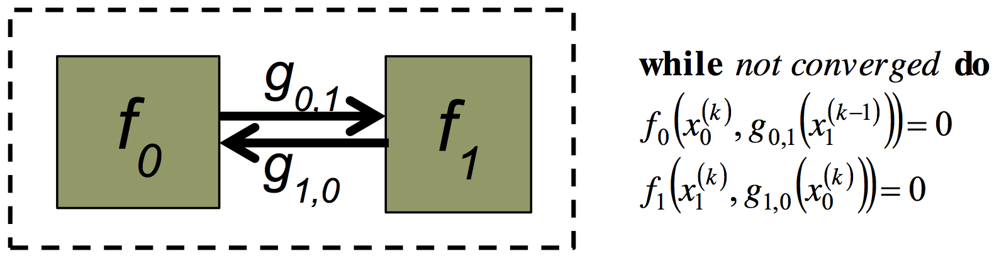

# Appendix D: Implementation of tight coupling

One of the major advantages of CAEBAT project is that the final product is an
open source software. In other words the user can become a developer and
implement his own simulation scenarios as well as integrate components into
VIBE. In this example we discuss implementation of tight coupling (Picard
iteration) between electrochemical (DualFoil) and Thermal components in VIBE.

In general, Picard iteration to a specified convergence criteria provides tight
coupling of two physics components f0 and f1 exchanging variables via functions
g. At each time step, a fixed-point iteration can be schematically represented
as follows.

{#fig:converged width=5.0in}

In terms of implementation in VIBE, such task is relatively simple and requires
creating the new simulation driver which would call the corresponding
components in the right sequence until the desired convergence is reached.
Drivers can be found in VIBE/trunk/components (see figure below).

{#fig:components width=1.0in}

Simulation drivers follow Python logic with the Driver class where the actual
call of components is performed. The sequence and number of components are
characteristic of the simulation setup. For instance the unit iteration
sequence in this example can be represented as

```python
class Driver(Component):

    def __init__(self, services, config):
        "code here"

    def step(self, timestamp=0):
        "code here"

    # Iterate throught the timeloop
    for t in tlist[1:len(timeloop)]:
        "code here"
        while abs(T_new_sum - T_old_sum) > tol :
            services.call(chartran_comp, 'init', t)
            services.call(chartran_comp, 'step', t)
            services.call(chartran_comp, 'finalize', t)

            services.call(electrical_comp, 'init', t)
            services.call(electrical_comp, 'step', t)
            services.call(electrical_comp, 'finalize', t)

            services.call(thermal_comp, 'init', t)
            services.call(thermal_comp, 'step', t)
            services.call(thermal_comp, 'finalize', t)
```

Where the Electrochemical (‘chartran’), Electrical and thermal components are
called in the above sequence at each time step. In this particular case the
convergence is checked in terms of temperatures from the current and previous
Picard iteration. The thermal component is coupled to DualFoil via
temperature-dependent diffusivities and Buttler-Volmer kinetics in DualFoil
component. To check the influence of tight coupling, simulations were run on an
unrolled cell with properties of the polymer cell described in Doyle, Fuller
1993. The results are shown in [@Fig:heat-source]. Weak dependence of sources on
temperature results in very fast convergence of Picard iterations (typically
within 4 iterations).

{#fig:heat-source width=5.0in}

