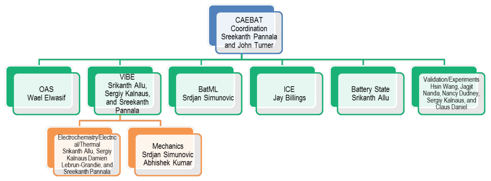

# Team

The CAEBAT ORNL team consists of multidisciplinary researchers working on
various aspects of computational science related to batteries and we are
working closely with the experimental groups at ORNL for validation. The team
structure is given below. More information can be found at the project website
[batterysim.org](http://batterysim.org).

{#fig:team width=5.0in}

